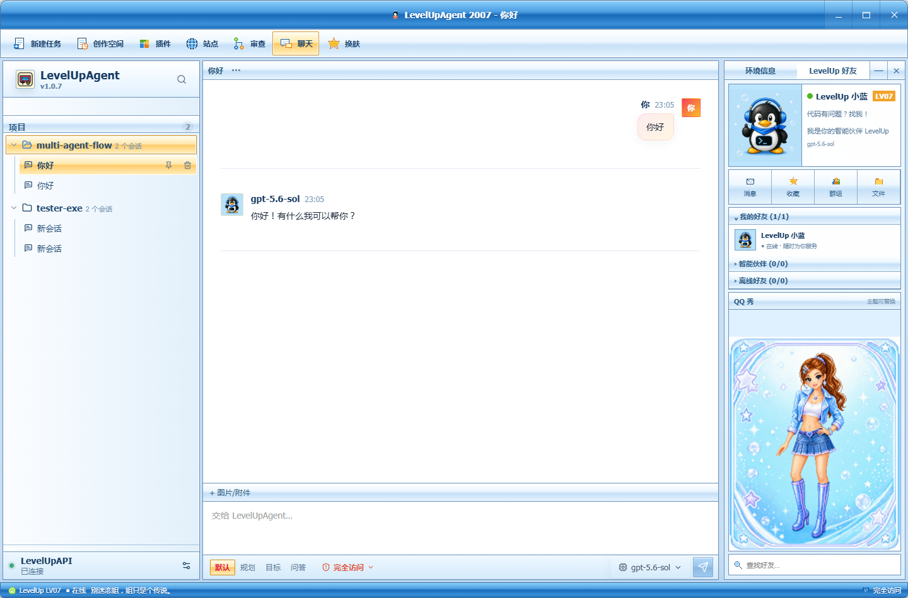

# LevelUpAgent QQ 2007 Theme

面向 [LevelUpAgent](https://github.com/mei-lun/LevelUpAgent) 的 QQ 2007 经典蓝色第三方主题，还有源项目[LevelUpAgent](https://github.com/TippingGame/LevelUpAgent)在这里。

它不是简单的颜色覆盖，而是一套与 LevelUpAgent 功能结合的完整工作台布局。主题启用后提供 QQ 2007 风格的标题栏、工具栏、项目树、会话区、好友/环境面板、输入区和状态栏；切换或卸载后会恢复 LevelUpAgent 默认界面。

## 实际演示



## 主要特性

- 一体化 QQ 2007 蓝色标题栏，不会与 Windows 系统标题栏重复。
- 右上角提供真实的最小化、最大化/还原和关闭按钮。
- 标题栏支持拖动，双击可最大化或还原窗口。
- 左侧保留 LevelUpAgent 项目与会话树。
- 中央保留消息、Markdown、代码块、审批、Diff、附件和输入功能。
- 右侧提供环境信息与 LevelUp 好友面板。
- 顶部工具栏连接新建任务、创作空间、插件、站点、审查、聊天和换肤功能。
- 支持安装、更新、切换和卸载。
- 图片全部内嵌，安装后不依赖本仓库路径或网络资源。

## 兼容要求

- 支持 schemaVersion 2 companion `layout.json` 的 LevelUpAgent 构建
- Windows、macOS 或 Linux 桌面版 LevelUpAgent
- Node.js 20 或更高版本（仅从源码构建主题时需要）

> 主题使用 LevelUpAgent schemaVersion 2 的独立声明式布局文件。较旧版本的 LevelUpAgent 不支持 companion `layout.json`，无法安装此版本。

## 直接安装

仓库已经包含构建好的主题包：

```text
levelup/dist/qq-2007/levelupagent-qq-2007.levelup-theme
levelup/dist/qq-2007/layout.json
```

安装步骤：

1. 启动 LevelUpAgent。
2. 打开左下角“模型连接”。
3. 进入“主题”。
4. 点击“安装主题包”。
5. 选择 `levelup/dist/qq-2007/levelupagent-qq-2007.levelup-theme`。

LevelUpAgent 会校验并同时安装主题包与布局文件。安装完成后主题会立即启用，并在下次启动时自动恢复。

## 切换、更新与卸载

- 切换：在“模型连接 → 主题”中选择其他已安装主题或默认主题。
- 更新：安装相同 ID 的新版本主题包，LevelUpAgent 会原子替换旧版本。
- 卸载：点击主题旁的垃圾桶按钮。
- 卸载当前主题：LevelUpAgent 会先切回默认主题，再删除主题包。

切回默认主题时，QQ 2007 专用布局、第三方 CSS 和自定义标题栏会一起移除，系统窗口栏会恢复。

## 从源码构建

在仓库根目录运行：

```bash
npm run build
```

构建产物：

```text
levelup/dist/qq-2007/levelupagent-qq-2007.levelup-theme
levelup/dist/qq-2007/layout.json
```

运行完整主题包自检：

```bash
npm test
```

测试会重新构建主题，并检查：

- CSS 是否全部限定在当前主题作用域内。
- 图片是否全部转换为内嵌 `data:` URL。
- 是否存在未解析的素材占位符。
- 是否使用远程 CSS、远程图片或 `@import`。
- 生成文件是否为有效的 LevelUpAgent schema v2 主题包与 schema v1 声明式布局。
- companion 布局是否包含且仅包含一次安全关键的 `workspace` slot。
- 无系统窗口装饰时是否提供真实的 QQ2007 标题栏控制。

## 项目结构

```text
LevelUpAgent-theme-QQ-2007/
├─ levelup/
│  ├─ assets/                  主题使用的背景、助手、QQ 秀和图标
│  ├─ dist/qq-2007/      该主题独占的发布目录
│  ├─ manifest.json            schemaVersion 2 主题信息和 companion 文件声明
│  ├─ layout.json              QQ2007 声明式布局、窗口和功能 slots
│  ├─ theme.css                QQ 2007 主题样式
│  ├─ build-theme.mjs          素材内嵌和主题打包脚本
│  └─ theme-package.test.mjs   主题包安全与完整性测试
├─ package.json                构建和测试命令
├─ LICENSE
└─ NOTICE.md
```

## 主题包说明

主题包是一个 UTF-8 JSON 文件，包含：

- `schemaVersion: 2`
- 主题 ID、名称、版本、作者和许可信息
- `layoutFile: "layout.json"`
- 严格作用域化的 CSS
- Base64 内嵌图片资源

独立 `layout.json` 使用布局 schemaVersion 1，定义标题栏、工具栏、左栏、会话区、右栏和状态栏的真实挂载顺序。它不包含 JavaScript 或任意宿主调用。

构建产物使用 `levelupagent-qq-2007.levelup-theme`，主题 ID、布局 ID 和发布目录统一使用 `qq-2007`。

## 安全边界

- 主题包不执行 JavaScript。
- 布局仅使用 LevelUpAgent 注册的 slots，不执行脚本或任意业务代码。
- 不读取或修改 API Key、Provider、会话、数据库和本地项目文件。
- 不包含远程 CSS、远程图片或可执行运行时。
- 不修改 LevelUpAgent 安装目录。
- 所有主题选择器都限定在 `html[data-levelup-theme="qq-2007"]`。
- 只有主题启用时才应用 QQ 2007 布局和窗口装饰。

## 开发规范

修改主题时：

1. 将图片放入 `levelup/assets/`。
2. 通过 `levelup/build-theme.mjs` 将图片内嵌到主题包。
3. 不添加全局、无作用域 CSS。
4. 不依赖主题仓库绝对路径。
5. 每次修改 CSS、素材、manifest 或构建器后运行 `npm test`。
6. 在真实 LevelUpAgent 中验证安装、切换、重启和卸载。
7. 涉及标题栏时，真实验证最小化、最大化、还原、关闭和拖动。

LevelUpAgent 宿主侧的完整主题开发规范见 LevelUpAgent 项目中的：

```text
docs/THEME_DEVELOPMENT.md
docs/THEME_AGENT_WORKFLOW.md
docs/THEMES.md
docs/LAYOUTS.md
```

## 许可与声明
本项目参考 [Codex-QQ-2007](https://github.com/source-project/Codex-QQ-2007) 项目继续开发。
本主题是非官方项目，与 LevelUpAgent、OpenAI、Tencent 或 QQ 无隶属、授权或赞助关系。项目历史、素材和商标说明见 [NOTICE.md](./NOTICE.md)。
